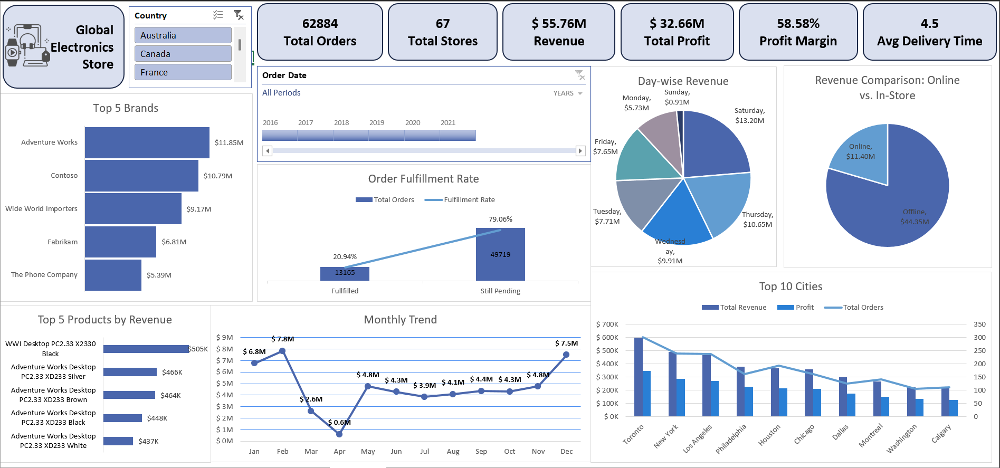

# Global Electronics Retail Sales Analysis Dashboard

An end-to-end Excel data analytics project analyzing sales, customer behavior, product performance, store performance, and order fulfillment for a global electronics retailer operating across 8 countries from **2016–2021**.

## Business Problem

The objective was to analyze sales transactions and build an interactive dashboard to answer key business questions related to:

- Total Revenue (USD)
- Order Fulfillment & Delivery Performance
- Sales Trends (Yearly & Monthly)
- Top Products & Categories
- Customer Spending Analysis
- Store & Geographic Performance
- Online vs. Offline Sales
- Product Category Performance by Country

## Tools Used

- Microsoft Excel
- Power Query
- Power Pivot
- Pivot Tables & Pivot Charts
- Slicers & Timeline

## Project Workflow

1. Imported multiple CSV datasets into Power Query.
2. Cleaned and transformed the data by correcting data types, formatting dates, and preparing the datasets for analysis.
3. Merged Sales and Products tables to include Unit Cost and Unit Price.
4. Built a Star Schema data model using Power Pivot.
5. Created calculated columns for Revenue, Total Cost, Profit, Profit %, Profit Margin, and Delivery Time.
6. Converted all sales values into a common currency (USD) using exchange rates.
7. Performed business analysis using Pivot Tables, Excel formulas, and Pivot Charts.
8. Built an interactive dashboard with slicers and timeline filters.

## Dashboard

## Key Insights

- Analyzed **62,884 orders** across **67 sales channels/stores**, generating **$55.76M revenue** and **$32.66M profit**.
- Physical stores generated significantly higher revenue than the online sales channel.
- The **United States** had the largest store network, while **Australia** had the fewest stores.
- **Computers, Home Appliances, and Cameras & Camcorders** were the highest revenue-generating categories.
- **Toronto** and **New York** were the top-performing cities by revenue and profit.
- Customers spent an average of **$3,652**, with similar purchasing behavior across both genders.
- Only **20.94%** of orders had recorded delivery dates, with an average delivery time of **4.5 days**.
- No significant correlation was found between order quantity and delivery time.

## Business Recommendations

- Investigate missing delivery records and improve logistics data quality.
- Increase inventory and marketing efforts during high-performing months and weekends.
- Continue investing in top-performing product categories.
- Strengthen the online sales channel to improve digital revenue.
- Expand successful strategies from top-performing cities to other regions.

## Skills Demonstrated

- Data Cleaning
- Data Transformation
- Data Modeling
- Star Schema
- Power Query
- Power Pivot
- Excel Dashboarding
- Pivot Tables
- Data Visualization
- Business Analysis
